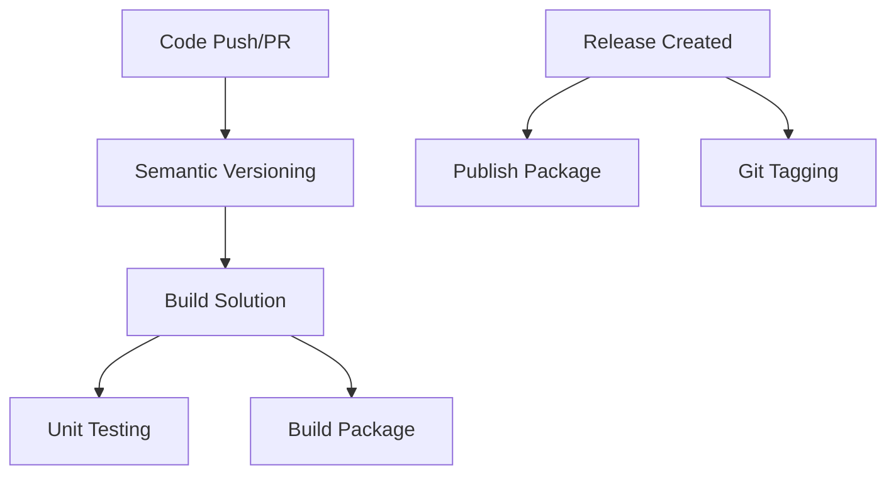

# GitHub Actions Reusable Workflows

[](https://opensource.org/licenses/MIT)
[](https://github.com/yourusername/github-actions/issues)
[](https://github.com/yourusername/github-actions/stargazers)

A comprehensive collection of reusable GitHub Actions workflows designed to streamline CI/CD processes for .NET projects. These workflows provide automated building, testing, packaging, and deployment capabilities while following best practices for maintainable and secure automation.

## ✨ Features

- 🏗️ **Build Automation** - Complete build workflows for .NET solutions and packages
- 🧪 **Testing Integration** - Automated unit testing with coverage reporting
- 📦 **Package Management** - NuGet package creation and publishing
- 🏷️ **Release Automation** - Git tagging and GitHub releases
- 📈 **Semantic Versioning** - Automated version management with GitVersion
- 🔄 **Reusable Components** - Modular workflows for easy adoption

## 🚀 Quick Start

### Using Workflow Templates

1. Navigate to your repository's **Actions** tab
2. Click **New workflow**
3. Browse **workflows made by [your-org]**
4. Select and configure the desired template

### Manual Setup

1. Create `.github/workflows/` directory in your repository
2. Copy the desired workflow files from this repository
3. Customize the workflow parameters for your project
4. Commit and push to trigger the workflows

## 📋 Available Workflows

| Workflow | Purpose | Triggers | Documentation |
|----------|---------|----------|---------------|
| **Semantic Versioning** | Automated version calculation | PR, Push | [📖 Docs](docs/version-semver-generic-ci.md) |
| **Build Solution** | .NET solution compilation | PR, Push | [📖 Docs](docs/build-solution-dotnet-ci.md) |
| **Unit Testing** | Test execution with coverage | PR, Push | [📖 Docs](docs/test-solution-dotnet-unit-tests.md) |
| **Build Package** | NuGet package creation | PR, Push | [📖 Docs](docs/build-package-dotnet-ci.md) |
| **Publish Package** | NuGet package publishing | Release | [📖 Docs](docs/publish-package-dotnet-release.md) |
| **Git Tagging** | Automated release tagging | Release | [📖 Docs](docs/tag-git-generic-release.md) |

## 🔧 Workflow Dependencies

The workflows are designed to work together in a complete CI/CD pipeline:



## 📁 Repository Structure

```text
├── .github/
│   ├── workflows/           # Reusable workflow implementations
│   ├── workflow-templates/  # Template files for easy adoption
│   └── ISSUE_TEMPLATE/     # Issue templates
├── docs/                   # Comprehensive documentation
├── CONTRIBUTING.md         # Contribution guidelines
├── LICENSE                 # MIT License
└── README.md              # This file
```

## 🛠️ Prerequisites

- **.NET 8.0 SDK** (configurable)
- **GitVersion** for semantic versioning
- **Repository secrets** configured as needed:
  - `NUGET_API_KEY` for package publishing
  - `GITHUB_TOKEN` (automatically provided)

## 📚 Documentation

Detailed documentation is available for each workflow:

- [🔢 Semantic Versioning](docs/version-semver-generic-ci.md) - Automated version calculation
- [🏗️ Build Solution](docs/build-solution-dotnet-ci.md) - .NET solution compilation
- [🧪 Unit Testing](docs/test-solution-dotnet-unit-tests.md) - Test execution and coverage
- [📦 Build Package](docs/build-package-dotnet-ci.md) - NuGet package creation
- [🚀 Publish Package](docs/publish-package-dotnet-release.md) - Package publishing
- [🏷️ Git Tagging](docs/tag-git-generic-release.md) - Release tagging

## 🤝 Contributing

We welcome contributions! Please see our [Contributing Guidelines](CONTRIBUTING.md) for details on:

- Code of conduct
- Development setup
- Submission process
- Coding standards

## 📄 License

This project is licensed under the MIT License - see the [LICENSE](LICENSE) file for details.

## 🆘 Support

- 📖 Check the [documentation](docs/) for detailed usage instructions
- 🐛 Report bugs via [GitHub Issues](https://github.com/yourusername/github-actions/issues)
- 💡 Request features using our [issue templates](.github/ISSUE_TEMPLATE/)
- 💬 Join discussions in the [GitHub Discussions](https://github.com/yourusername/github-actions/discussions)

## 🌟 Acknowledgments

- GitVersion for semantic versioning automation
- GitHub Actions team for the powerful automation platform
- .NET community for best practices and patterns

---

**Made with ❤️ for the .NET community** By centralizing our build, test, and deployment logic here, we ensure consistency and reduce code duplication across all our projects. All workflow documentation is maintained in the [`docs/`](./docs/) directory for clarity and maintainability.

## Workflow Naming Convention & Best Practices

To maximize clarity and reusability, all workflow files in this repository should follow a descriptive naming pattern:

**Pattern:** `[verb]-[noun]-[type]-[purpose].yml`

- **Verb:** What action the workflow performs (e.g., `build`, `test`, `deploy`, `scan`).
- **Noun:** What the action is performed on (e.g., `solution`, `container`, `node`, `package`).
- **Type/Technology:** The language, framework, or tool (e.g., `dotnet`, `node`, `azure`, `docker`).
- **Purpose:** The specific context (e.g., `ci`, `unit-tests`, `appservice`, `pr`).

**Examples:**

- `build-solution-dotnet-ci.yml`
- `build-package-dotnet-ci.yml`
- `test-solution-dotnet-unit-tests.yml`
- `publish-package-dotnet-release.yml`

**Best Practices:**

- Use the full naming pattern for new workflows. For legacy workflows, update names as needed.
- Document all workflow inputs, outputs, and secrets in the corresponding file in [`docs/`](./docs/).
- Use tags (e.g., `@v1.0.0`) when referencing workflows for stability.
- Keep workflows modular and focused on a single responsibility.
- Use clear, descriptive job and step names within workflows.

## Documentation Structure

Each workflow has a dedicated documentation file in the [`docs/`](./docs/) directory:

- [Build Solution (.NET CI)](./docs/build-solution-dotnet-ci.md)
- [Test Solution (.NET Unit Tests)](./docs/test-solution-dotnet-unit-tests.md)
- [Build Package (.NET CI)](./docs/build-package-dotnet-ci.md)
- [Publish Package (.NET Release)](./docs/publish-package-dotnet-release.md)
- [Tag Git (Generic Release)](./docs/tag-git-generic-release.md)
- [Version (Semantic, Generic CI)](./docs/version-semver-generic-ci.md)

Each documentation file includes:

- Purpose and overview
- Inputs, outputs, and secrets
- Example usage
- Best practices

**Always use a specific tag** (e.g., `@v1.0.0`) when referencing workflows, not a branch like `@main`.

### Example: Calling a Workflow

See the relevant documentation in [`docs/`](./docs/) for up-to-date usage examples for each workflow.

---

## Template & Workflow Synchronization

For every workflow implementation in `.github/workflows`, there must be a corresponding template and properties file in `.github/workflow-templates`, and vice versa. This ensures that reusable logic, documentation, and metadata remain consistent and easy to maintain across the repository.

**Maintenance Rule:**

- Whenever you add, update, or remove a workflow, always ensure the matching template (`*-template.yml`) and properties JSON (`*-template.properties.json`) are also created, updated, or removed as needed.
- The template and workflow should have matching input parameters and logic, and filenames should follow the established naming convention.

This practice guarantees that all workflows are reusable, discoverable, and properly documented for all consumers of this repository.

## Contributing

We welcome contributions to this repository! Please follow our guidelines to ensure a smooth review process:

1. **Fork** this repository and clone it locally.
2. **Create a branch** from `develop` for your change. Use a descriptive name, such as `feature/your-feature` or `fix/issue-description`.
3. **Make your changes**. If you add or update a workflow, document it in the [`docs/`](./docs/) directory.
4. **Test and lint** your changes. Ensure all workflows and code pass CI and linting checks.
5. **Open a Pull Request** (PR) to the `develop` branch. Fill out the PR template if available.
6. **Request review** from the relevant maintainers.
7. Respond to feedback and make any requested changes.

For more details, see [`CONTRIBUTING.md`](./CONTRIBUTING.md).

Thank you for helping us improve our workflows!
